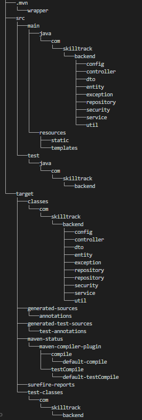

# SkillTrack – Student Skill Management Platform

SkillTrack is a **full-stack web application** designed to help students **track, manage, and showcase their skills**, while enabling admins or institutions to analyze skill data in a structured and secure way.

This project is being built **step by step using industry-level practices**, making it ideal for **learning, internships, and real-world backend development exposure**.

### Problem Statement

Many students:
- Learn multiple skills but **lack a structured way to track them**
- Cannot **showcase verified skills** effectively
- Do not know their **skill gaps or progress level**

**SkillTrack solves this problem** by providing a centralized, secure, and scalable skill-tracking platform.

### What SkillTrack Does (Current Features)

####  Backend (Spring Boot – In Progress)
-  JWT-based Authentication
-  Role-based Authorization (**STUDENT / ADMIN**)
-  User Profile Management
-  Secure REST APIs
-  PostgreSQL Database Integration
-  Swagger API Documentation

### Tech Stack

#### 🔹 Backend
- **Java 17**
- **Spring Boot 3**
- **Spring Security + JWT**
- **Spring Data JPA**
- **PostgreSQL**
- **Maven**

#### 🔹 Frontend (Planned)
- **React.js**
- **Tailwind CSS**
- **Axios**

#### 🔹 Dev & Tools
- **Git & GitHub (Feature-branch workflow)**
- **Swagger**
- **Postman**
- **IntelliJ / VS Code**

###  Project Structure

### Authentication Flow

1. User registers or logs in
2. Backend generates a **JWT token**
3. Token is required for accessing secured APIs
4. Role-based access is enforced

### API Documentation

Swagger UI is available when the backend is running:

http://localhost:8081/swagger-ui/index.html

### Roadmap & Future Features

####  Phase 1 – Skill Management
-  Add / update / delete skills
-  Skill proficiency levels
-  Student skill dashboard APIs

####  Phase 2 – Admin & Analytics
-  Admin dashboard
-  Skill analytics
-  Skill validation workflow

####  Phase 3 – Frontend & UX
-  React frontend
-  Charts & progress visualization
-  Resume-ready skill export

---

### Development Approach

-  Feature-based Git branches
-  Clean architecture  
  **Controller → Service → Repository**
-  Small, meaningful commits
-  Industry-standard coding practices

###  Who Is This Project For?

-  Students building a strong tech portfolio
-  Recruiters evaluating real backend skills
-  Institutions tracking student skill growth

###  Project Status

 **Actively under development**  
 **Started:** January 2026

###  Why Recruiters Should Look at This Repo

-  Real backend architecture (not a tutorial clone)
-  Secure authentication & authorization
-  Clean code structure
-  Organized Git history
-  Scalable project design

###  Author

**Vivek Kumar**  
B.Tech Student  
Backend Developer (Spring Boot)  

🔗 GitHub:  
https://github.com/Vivek-Kumar-IIITD24

###  Contributions

This is currently a **personal learning & portfolio project**.  
Contributions may be opened in future phases.

⭐ If you find this project useful, feel free to star the repository!

